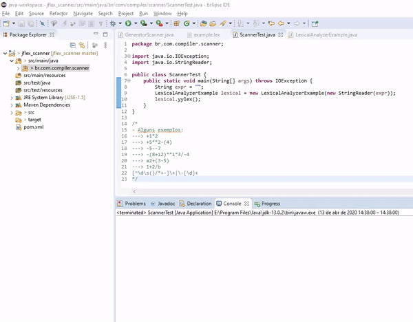

# Jflex-scanner

Crie um analisador léxico de uma calculadora. O objetivo será criar uma tabela de tokens e seus tipos:

- As operações da calculadora são: `+`, `-`, `*`, `/`, `**` (potenciação)
- A calculadora deve aceitar números inteiros positivos e negativos
- Serão aceitos parênteses
- Veja o seguinte exemplo: Sequência de tokens para o exemplo Exemplo de expressão aritmética `42 + ( 675 * 31 ) - 20925`

### Como executar
Clone esse repositório com `git clone https://github.com/Caiocp/jflex-scanner.git`

A entrada é feita no arquivo `ScannerTest`, basta colocar a entrada, salvar o arquivo e rodá-lo

Os tokens aceitos são definidos no arquivo `example.lex`

### Limitações para a entrada
Para o correto reconhecimento os números **devem** ser separador por espaço, exceto números com sinal

`1 + 1`✔️

`1 + -1`✔️

`1+1`❌

### Exemplo

